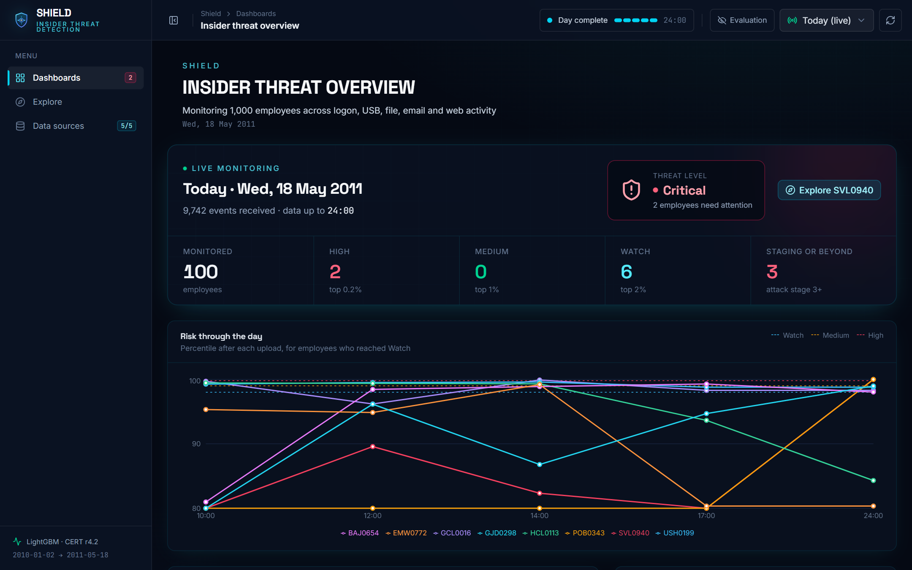
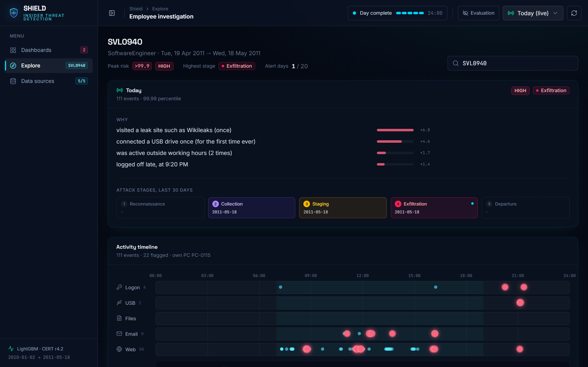
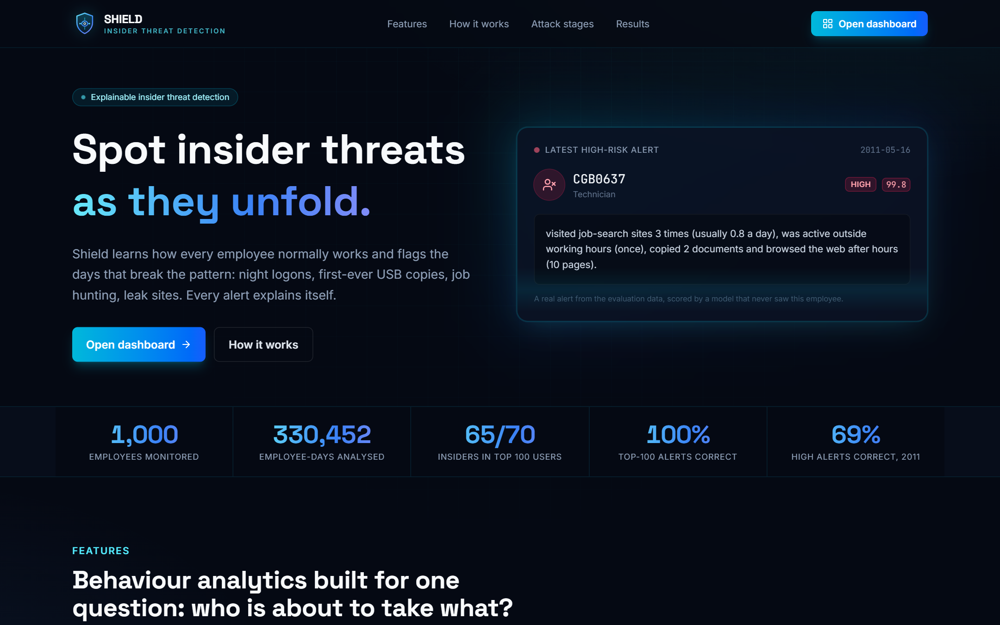

# Shield: Insider Threat Detection

Shield finds employees who may be stealing data or sabotaging systems by learning what normal behaviour looks like
for each person and flagging days that break their pattern. It is trained and evaluated on the public
[CERT Insider Threat Test Dataset](https://kilthub.cmu.edu/articles/dataset/Insider_Threat_Test_Dataset/12841247)
(release r4.2) from Carnegie Mellon University, and comes with a web dashboard that monitors a new day of activity
as log files arrive.

Every number in this README was recomputed from the saved model outputs in `reports/` and `models/`.

## Results at a glance

| | Result |
|---|---|
| Insiders found among the 100 riskiest employees | **65 of 70** (49 of the top 50 are insiders) |
| User-day PR-AUC (5-fold cross-validation on unseen employees) | **0.526** (random guessing: 0.003) |
| User-day ROC-AUC | 0.959 |
| Attack days caught by the daily alert budget (riskiest 1% of days) | **71%** |
| Precision of the 100 highest-scored days | 100% |
| Insiders reaching the "Staging" attack stage or beyond | **67 of 70**, a median of 10 days before their attack ended |
| Replay day: replayed attacks detected by the end of the day | **5 of 5** (2 at High, 3 at Watch) |

## Screenshots

**Live dashboard**: threat level, alert counts and every flagged employee's risk through the replay day.



**Employee investigation**: why the employee was flagged, how far the attack has progressed, and every event of
the day on a 24-hour timeline with risky events highlighted.



**Landing page**



## How it works

```
raw CERT logs ──► daily summaries ──► features ──► LightGBM ──► risk score ──► alert level
(logon, USB,       per employee       vs own past     800 trees    per            High / Medium / Watch
 file, email,      per day            30 days and                  employee-day        │
 web)                                 vs same-role                                     ├──► plain-English story (SHAP)
                                      colleagues                                       └──► attack-stage tracker
```

1. **Preprocess** (`shield/ingest.py`): the five activity logs become one row per employee per day: logons,
   after-hours activity, logons on other people's PCs, USB connections, files copied, email recipients and
   attachments, and web visits by category (job search, leak sites, upload sites, hacking pages, rare domains).
2. **Label** (`shield/labels.py`): days containing an event from the official answer key are malicious.
3. **Features** (`shield/features.py`): each day is compared with the employee's own previous 30 days (z-score, ratio,
   first-ever occurrence) and with colleagues in the same role. Baselines only use past days, so no feature sees the
   future. 133 features in total.
4. **Train** (`shield/train.py`): LightGBM with a fixed 800 trees and class weighting, evaluated with 5-fold
   cross-validation grouped by employee, so every score comes from a model that never saw that person.
5. **Explain** (`shield/explain.py`): SHAP contributions are turned into a short story with the person's real numbers.
6. **Track stages** (`shield/stages.py`): evidence is mapped to attack stages, from reconnaissance to departure.
7. **Replay** (`shield/replay.py`, `shield/monitor.py`): a new day is built from real CERT attacks and monitored
   upload by upload in the dashboard.

## Dataset

| | |
|---|---|
| Employees | 1,000 |
| Period | 2 Jan 2010 to 17 May 2011 |
| Employee-days | 330,452 |
| Malicious employee-days | 986 (0.298%) |
| Insiders | 70: 30 data leaks (scenario 1), 30 thefts before quitting (scenario 2), 10 rogue admins (scenario 3) |
| Malicious days by scenario | 85, 861 and 40 |

The data is synthetic, generated by CERT with planted insiders. In scenario 3 a system administrator logs in as their
supervisor, so two supervisors (FAW0032, FBA0348) have attack days recorded on their accounts. Those days stay labelled
malicious, because Shield should flag a compromised account, but employee-level results count only the 70 insiders.

## Removing shortcuts

CERT generates some activity at fixed rates and adds attack events on top. A model can learn "more than your fixed
number means attack", which scores very well on CERT and means nothing for real people:

- every employee views an almost fixed number of web pages a day: 86 on average, and identical to the person's usual
  count on 99.8% of normal days;
- every employee logs on once a day and sends an almost constant number of emails.

These volume totals (`http_n`, `logon_n`, `logoff_n`, `email_n`, `email_recipients`, `http_distinct_domains` and their
deviation features) are excluded, together with inputs that describe who a person is rather than what they did:
personality scores, role, unit, department and days active (`config.EXCLUDED_FEATURES`). Role is still used to compare
a person with colleagues. Removing the shortcuts lowered the scores, and the results below are the honest ones.

The most important features are all behavioural: USB use compared with colleagues and with the person's own history,
job-search sites, files copied, logons on other PCs, zip files copied and after-hours logons.

## Results

### Cross-validation (5 folds, grouped by employee)

| Level | PR-AUC | ROC-AUC | Other |
|---|---|---|---|
| Employee-day | 0.526 (random 0.003) | 0.959 | top 100 days: 100% malicious |
| Employee | 0.926 | 0.986 | top 50: 49 insiders; top 100: 65 of 70 |

Attack days caught in the riskiest 1% of days: scenario 1 89%, scenario 2 70%, scenario 3 45%. The tree count was
chosen on this same cross-validation, so these numbers are slightly optimistic; the tests below avoid that.

### Stricter tests (`python run_pipeline.py --only evaluate`)

Each test trains a fresh model on one part of the data and scores a part it never saw once. Alerts use Shield's
budgets: **Medium+** is the riskiest 1% of the test days, **High** the riskiest 0.2%.

| Test | Train on | Test on | Malicious test days | PR-AUC (random) | Medium+ alerts | High alerts |
|---|---|---|---|---|---|---|
| A: unseen employees | 800 employees | 200 other employees | 142 (14 insiders) | 0.669 (0.002) | 656 alerts, 121 correct: recall 85%, precision 18% | 132 alerts, 82 correct: recall 58%, precision 62% |
| B: future days | all employees, 2010 | all employees, Jan–May 2011 | 246 (18 insiders) | 0.566 (0.003) | 841 alerts, 176 correct: recall 72%, precision 21% | 169 alerts, 116 correct: recall 47%, precision 69% |
| C: unseen employees and future days | 800 employees, 2010 | 200 other employees, 2011 | 56 (3 insiders) | 0.506 (0.003) | 162 alerts, 38 correct: recall 68%, precision 23% | 33 alerts, 23 correct: recall 41%, precision 70% |

In every test, all insiders in the test set are among the 50 riskiest employees. Test C has only 3 insiders, so treat
it as indicative.

### Alert levels (`shield/levels.py`)

Attacks are 0.3% of days, so a fixed 0.5 threshold is useless. Levels are set by **alert budget** from the
cross-validation scores, which gives analysts a predictable workload:

| Level | Riskiest share of days | Risk cut-off | Alerts per day | Precision | Attack days caught |
|---|---|---|---|---|---|
| High | 0.2% | 0.526 | 1.3 | 64% | 43% |
| Medium or above | 1% | 0.0085 | 6.6 | 21% | 71% |
| Watch or above | 2% | 0.00105 | 13.2 | 12% | 79% |

The dashboard shows each score as a percentile: "riskier than 99.3% of all 2010–2011 employee-days".

### Explainable alerts (`python run_pipeline.py --only explain`)

Every day at Medium or above gets a story, written to `reports/alerts.csv` and `reports/alerts.md`. For example, a real
attack day scored High:

> CAH0936 (ComputerScientist) on Thu 12 Aug 2010: visited a leak site such as Wikileaks (once), browsed the web after
> hours (21 pages), connected a USB drive once (usually 0.1 a day) and visited job-search sites 11 times (usually 2.3 a day).

- SHAP values (`pred_contrib=True` in LightGBM) measure how much each feature pushed the risk up; features are grouped
  into readable signals and the strongest become sentences filled with the person's real numbers.
- A signal is only cited when today's activity is clearly above normal (at least 20% above the person's usual, a
  first-ever occurrence, or well above colleagues), so a story never cites lower activity as a reason.
- 3,305 alerts, 698 of them on real attack days; 3.2 reasons per alert on average; 94 alerts have no single clear
  reason and say "unusual activity overall".

### Attack-stage tracker (`python run_pipeline.py --only stages`)

| Stage | Evidence on a day |
|---|---|
| 1 Reconnaissance | job-search or hacking sites clearly above the person's normal |
| 2 Collection | file copying clearly above normal, after-hours logon, or logon to someone else's PC |
| 3 Staging | USB use clearly above normal or first ever, after-hours USB, zip or exe files copied |
| 4 Exfiltration | leak site, or upload sites or external attachments clearly above normal |
| 5 Departure | the person leaves the company with stage 1 or higher in the previous 60 days |

Evidence only counts on days the model already rates risky (risk ≥ 0.2) and fades after 30 days. The gate matters:
many innocent people visit job sites, and the "leak" keyword matches 61 employees, only 31 of them insiders.

| Evidence gate | Insiders reaching Staging or beyond | Other employees reaching Staging or beyond |
|---|---|---|
| none | 70 of 70 | 928 of 930 |
| **risk ≥ 0.2 (used)** | **67 of 70** | **43 of 930 (4.6%)** |
| Medium level | 69 of 70 | 121 of 930 |
| Watch level | 69 of 70 | 217 of 930 |

By scenario, Staging or beyond is reached by 29 of 30 data leaks, 29 of 30 thefts and 9 of 10 rogue admins.
Exfiltration evidence is seen for 29, 26 and 5 of them: a rogue admin's mass email is sent from the supervisor's
account, so it does not appear on the insider's own account.

### Replay day: monitoring a day the model has never seen

**Wed 18 May 2011**, the day after the CERT data ends, is built from real data (`python run_pipeline.py --only replay`):

- 100 employees still employed at the end of the data, none of them real insiders, each with their real activity from
  their most recent workday moved to 18 May;
- 5 of them additionally receive a **real CERT attack** copied onto their account at its original time of day;
- a **holdout model** (`models/holdout_lgbm.txt`) is trained on all other data (329,459 employee-days) without the 5
  replayed insiders, so it has never seen these attacks.

| Attacker | Replayed insider | Scenario | Attack events |
|---|---|---|---|
| BAJ0654 | PSF0133, 1 Sep 2010 | Theft before quitting | 16 events, 10:04–17:57 |
| CMW0783 | FSC0601, 3 Mar 2011 | Theft before quitting | 17 events, 10:21–16:44 |
| GJD0298 | BBS0039, 12 Aug 2010 | Rogue admin | 12 events, 10:24–19:15 |
| POB0343 | AJR0932, 10 Sep 2010 | Data leak | 5 events, 19:12–20:50 |
| SVL0940 | BIH0745, 13 Jul 2010 | Data leak | 5 events, 20:15–21:20 |

The day arrives as five uploads (00–10, 10–12, 12–14, 14–17, 17–24). After each one, `shield/monitor.py` rebuilds the
features with the training code, fills in the rest of each person's workday from their usual activity (a now-cast,
not needed at 24:00), compares with colleagues using every role's last 30 days, and scores with the holdout model.

| Data up to | Attackers flagged | Other employees flagged |
|---|---|---|
| 10:00 | none (no attack has started) | 3 Medium, 4 Watch |
| 12:00 | BAJ0654 Watch | 2 Medium, 6 Watch |
| 14:00 | BAJ0654 Watch | 1 High, 3 Medium, 3 Watch |
| 17:00 | BAJ0654 Medium, CMW0783 Watch | 2 Watch |
| 24:00 | **all 5**: POB0343 and SVL0940 High; GJD0298, CMW0783 and BAJ0654 Watch | 3 Watch |

Early uploads have more false alarms because the rest of the day is estimated. The night-time leaks (leak site plus a
first-ever USB connection at night) are clear; the thefts and the rogue admin stay at Watch, because 4.4% of normal
CERT days already have 5 or more USB connections, so USB use alone is weak evidence.

## Dashboard

`python -m server` serves a landing page at `http://127.0.0.1:8000/` and the dashboard at `http://127.0.0.1:8000/app`.
The landing page reads its figures from `reports/` through the API, and its example alert is a real alert.

| Page | What it shows |
|---|---|
| **Dashboards** | **Today (live)**: threat level, counts per alert level, risk through the day, every employee with their main reason, and for the selected employee the reasons and attack stages. **Any period** (time picker: last 7, 30 or 90 days, last year, all data or a custom range): alerts per day, an alert calendar, highest attack stage, riskiest employees and recent alert stories. |
| **Explore** | The employees flagged today and a search over all employees. For one employee: peak risk, highest stage and alert days in the range, daily risk percentile, earlier alerts, and for the monitored day the reasons, attack stages and an **activity timeline** of every event on a 24-hour axis with flagged events explained. |
| **Data sources** | Upload activity log CSV files (the five replay files are in `shield_data/replay/2011-05-18/`), the expected file format, each upload slot with the alerts after it, and a reset. |

**Evaluation** (top bar) compares Shield with the answer key: attackers caught and missed, false alarms, and each
employee or alert labelled. It only measures the model, since a real company has no answer key. It never changes a
score, level or ranking, and the server only sends the answers while it is switched on.

## Getting started

Requirements: Python 3.11 or newer and Node.js 20.19 or newer.

1. **Data.** Download `r4.2.tar.bz2` and `answers.tar.bz2` from the dataset link above (about 13 GB extracted) and
   extract them outside the project:

   ```
   <home>/shield_data/raw/r4.2/       logon.csv, device.csv, file.csv, email.csv, http.csv, LDAP/, psychometric.csv
   <home>/shield_data/raw/answers/    insiders.csv, r4.2-1/, r4.2-2/, r4.2-3/
   ```

   Set `SHIELD_DATA_DIR` to use another location.

2. **Pipeline.**

   ```bash
   pip install -r requirements.txt
   python run_pipeline.py                  # preprocess, labels, features, train, evaluate, explain, stages, replay
   python run_pipeline.py --only train     # rerun one stage
   python run_pipeline.py --to features    # stop after a stage
   ```

3. **Dashboard.**

   ```bash
   cd web && npm install && npm run build && cd ..
   python -m server
   ```

   Open `http://127.0.0.1:8000/app`, go to Data sources and upload the five replay files in order.

### Run with Docker

The image contains the code, the built dashboard, the trained models and the reports; the data folder is mounted
from your computer. Copy `.env.example` to `.env` and set `SHIELD_DATA_DIR` to your `shield_data` folder, then:

```bash
docker compose up -d --build
```

Open `http://127.0.0.1:8000`. To run the pipeline inside the container (models and reports are written back to the
project folder):

```bash
docker compose run --rm shield python run_pipeline.py
```

## Tests

```bash
python -m pytest
```

12 tests check the properties the results depend on:

- baselines never use future days, and first-time flags fire only once;
- preprocessing counts (after-hours logons, logons on other PCs, first logon and last logoff) are correct;
- features built for a subset of employees, as the live monitor does, are identical to the training table;
- the saved models never use the excluded shortcut features or any answer-key column;
- every stored alert is exactly a model score at or above the Medium cut-off (the answer key labels alerts, it never selects them);
- alert levels are ordered and percentiles are monotonic;
- stories never cite lower-than-usual activity as a reason;
- the monitor rejects invalid uploads and ignores duplicate events;
- the server blocks path traversal and oversized uploads, hides the answer key unless asked, and searches all employees.

## Project structure

```
shield/            pipeline package
  config.py        paths, settings, excluded features
  ingest.py        raw logs -> one row per employee-day per source
  labels.py        answer key -> malicious employee-days
  features.py      daily table + own-history and colleague deviation features
  train.py         grouped 5-fold cross-validation + final LightGBM model
  evaluate.py      unseen-employee, future-day and combined tests
  explain.py       SHAP -> plain-English stories
  stages.py        attack-stage tracker
  levels.py        alert budgets and percentiles
  replay.py        replay day, answer key, holdout model
  monitor.py       scores each upload of the replay day
server/            FastAPI backend (python -m server)
web/               React, TypeScript and Tailwind dashboard (npm run build)
tests/             pytest suite
models/            shield_lgbm.txt (main), holdout_lgbm.txt (replay day), feature lists
reports/           metrics, test results, alerts, attack stages
run_pipeline.py    runs the pipeline stages
Dockerfile         image with the dashboard, models and reports (docker-compose.yml runs it)
```

## Limitations

- CERT is synthetic. The model has learned CERT's attack patterns; real deployments would need retraining on real
  logs and a review of which signals hold up.
- Scenario 3 (rogue admin) is the hardest: 45% of its attack days are caught in the daily budget, compared with 89%
  for data leaks.
- Precision at the Medium level is about 21%, so roughly four in five Medium alerts are false alarms; High alerts are
  right about two times in three.
- Partial-day scores rely on an estimate of the rest of the day and produce more false alarms early in the day.

## Author

**Mallikarjuna C**, AI Research Engineer · [LinkedIn](https://www.linkedin.com/in/mallikarjunac1006)

The CERT Insider Threat Test Dataset is provided by the Software Engineering Institute, Carnegie Mellon University.
It is not included in this repository.
